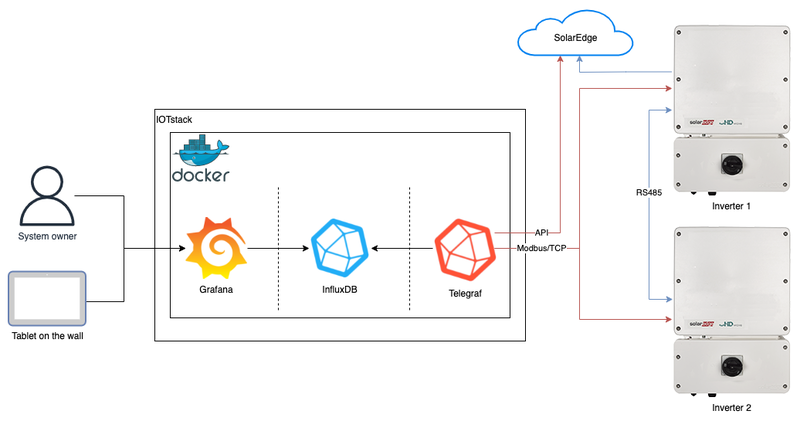
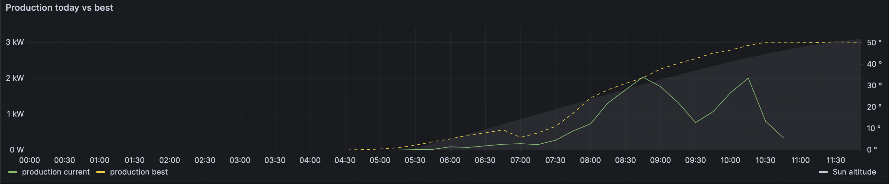
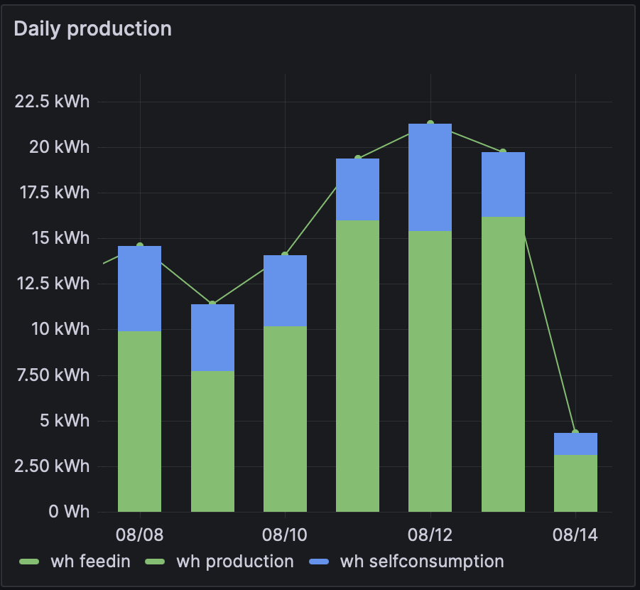
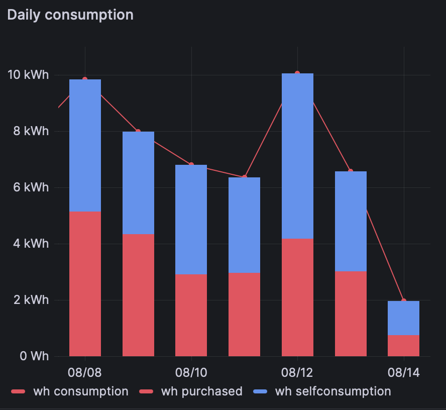
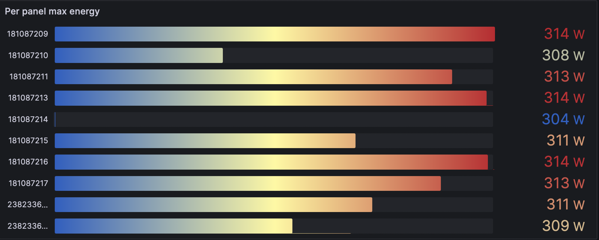

# Solar Energy Monitoring System

## Table of Contents

1. [General Info](#general-info)
2. [Features](#features)
3. [Solution Architecture](#solution-architecture)
4. [Technologies and Components Used](#technologies-and-components-used)
5. [Monitoring Dashbord](#monitoring-dashbord)
6. [Running in Docker Containers ](#running-in-docker-containers)
   * [To Set Up All Containers](#to-set-up-all-containers)
   * [Running only Grafana with dependencies](#running-only-grafana-with-dependencies)
   * [Running only Influxdb](#running-only-influxdb)
   * [Running only Telegraf with dependencies](#running-only-telegraf-with-dependencies)
7. [Inspirations and Acknowledgments](#inspirations-and-acknowledgements)


## General Info

This project is designed to provide real-time monitoring of solar energy production, presenting both the overall energy generation as well as individual energy output for each solar panel. The program retrieves data from the SolarAge API, stores it in InfluxDB, and displays it using Grafana. The system consists of the Telegraf + InfluxDB + Grafana software stack, along with custom configuration files and scripts.


## Features

- Monitoring of energy production from each solar panel
- Data retrieval from SolarAge API
- Storage of data in InfluxDB
- Visualization of data using Grafana dashboards


## Solution Architecture

The structure of the monitoring system is described below. On one side, there are two inverters linked to the IP network, creating a networked setup. Inverter #1 serves as the leader, while #2 operates in a subordinate role. Inverter #1 collects data from #2 and sends it to the SolarEdge cloud, accessible via the SolarEdge web interface by both installers and system owners.



Telegraf periodically fetches data from the SolarEdge API, with a primary focus on obtaining optimizer data for individual panels, which isn't directly available through the standard connection.

The data stored in InfluxDB is presented through Grafana dashboards. These dashboards can be interactively explored by system owners or passively displayed on a tablet or computer screen, providing a convenient method for quickly evaluating the system's health and performance.


## Technologies and Components Used

- [Python](https://www.python.org/) for programming
- [Telegraf](https://www.influxdata.com/time-series-platform/telegraf/) for data scraping
- [InfluxDB](https://www.influxdata.com/products/influxdb/) for data storage
- [Grafana](https://grafana.com/) for real-time data visualization
- [SolarAge API](https://example.com/solarage-api) as data source
- [Docker](https://www.docker.com/) for containerization

     


## Monitoring Dashbord

Data is displayed through Grafana, accessible locally at http://localhost:3000. Use the default username (admin) and password (admin), opt out of changing the password, and there you have it – your SolarEdge real-time monitoring interface is ready!

The general dashboards include:
* Production today vs best
* Daily production
* Daily consumption
* Power
* Per panel max energy


Example dashboards (Output from 14.08.2023):






Additionally, you'll find more detailed information about each panel, including:
* Per panel power
* Per panel power - best day comparison
* Inverter Temperature
* Ground Fault Resistance
* AC Voltage
* AC Frequency

## Running in Docker Containers 

### **To Set Up All Containers**:

Navigate to the project directory and run the following command to start all the containers together:
```
docker-compose up 
```

### **Running only Grafana with dependencies**:

To start the Grafana container:
- Navigate to the project directory. 
- Use the following command:

```
docker-compose up grafana
```

Access Grafana at:

- URL: [http://localhost:3000](http://localhost:3000)
- Username: `admin`
- Password: `password`

### **Running only Influxdb**:

To start the Influxdb container:
- Navigate to the project directory. 
- Use the following command:

```
docker-compose up infulxdb
```
Access Influxdb at:

- URL: [http://localhost:8086](http://localhost:8086)
- Username: `admin`
- Password: `password`

### **Running only Telegraf with dependencies**:

To start the Telegraf container:
- Navigate to the project directory. 
- Use the following command:

```
docker-compose up telegraf
```
**Note: Telegraf depends on InfluxDB, so it will be started automatically if you set up Telegraf.


**Notes:**

1. Make sure to have Docker Compose installed on your system. 
2. The `depends_on` field ensures that Telegraf and Grafana wait for InfluxDB to be up and running before starting.
3. Adjust the configuration as needed, especially if you need specific ports or volumes for your environment.
4. The provided YAML file assumes you have necessary configurations in the respective directories, such as `telegraf/telegraf.conf`, etc.

Please ensure that you have the necessary configuration files and Docker images available as specified in the file paths within the `docker-compose.yml` file.

**Important Note for macOS Users:**

If you are using macOS, please be aware that you need to set up Docker manually before starting the program. Docker may require additional setup steps to work seamlessly on macOS. Please ensure that you have Docker installed and properly configured before running the provided docker-compose setup.

## Inspirations and Acknowledgments

I would like to acknowledge the following sources for inspiring and contributing to this project:

1. Nelis Oostens for his original solution for Solar Edge inverters, which served as an inspiration for creating my own dashboards and setup. You can find his work at [Nelis Oostens SolarEdge Monitoring](http://oostens.me/posts/solaredge-se3000h-monitoring/).

2. Matjaž Bravc for his remarkable work on the SolarEdge Monitoring Demo. Their contributions provided valuable insights and guidance for aspects of this project. Check out his project here: [Matjaž Bravc SolarEdge Monitoring Demo](https://github.com/matjazbravc/SolarEdge.Monitoring.Demo).

3. Joe Manna for sharing his experience in monitoring a multi-inverter SolarEdge system. Their insights and solutions have been helpful in the development of this project. You can read about it here: [Monitoring a Multi-Inverter SolarEdge System](https://www.packetmischief.ca/2022/01/09/monitoring-a-multi-inverter-solaredge-system/).


This project also draws inspiration from my personal experience with my own solar panels. The desire to create a customized program to better monitor energy generation from my panels was a driving force behind this initiative. I wanted to develop a solution that would allow me to track energy production more effectively and gain a deeper understanding of how my panels perform.
